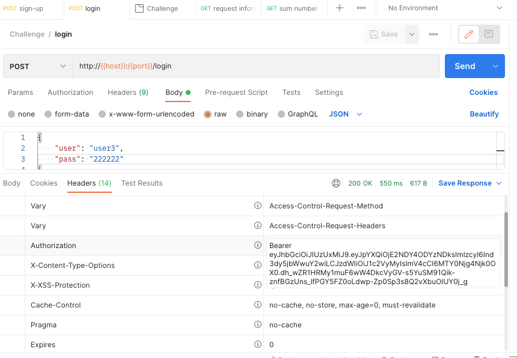

# Getting Started

### Reference Documentation
For further reference, please consider the following sections:

* [Official Apache Maven documentation](https://maven.apache.org/guides/index.html)
* [Spring Boot Maven Plugin Reference Guide](https://docs.spring.io/spring-boot/docs/2.6.2/maven-plugin/reference/html/)
* [Spring Web](https://docs.spring.io/spring-boot/docs/2.6.2/reference/htmlsingle/#boot-features-developing-web-applications)
* [Spring Boot DevTools](https://docs.spring.io/spring-boot/docs/2.6.2/reference/htmlsingle/#using-boot-devtools)
* [Spring Data JPA](https://docs.spring.io/spring-boot/docs/2.6.2/reference/htmlsingle/#boot-features-jpa-and-spring-data)
* [Docker](https://docs.docker.com/)
* [RabbitMQ](https://www.rabbitmq.com/)

### Guides
The following guides illustrate how to use some features concretely:

* [Building a RESTful Web Service](https://spring.io/guides/gs/rest-service/)
* [Serving Web Content with Spring MVC](https://spring.io/guides/gs/serving-web-content/)
* [Building REST services with Spring](https://spring.io/guides/tutorials/bookmarks/)
* [Accessing Data with JPA](https://spring.io/guides/gs/accessing-data-jpa/)

## Run locally with Docker Compose

Requirements:
 * You need a IOS or Unix Operative system for execute correctly the following command
 * Must be need to install Docker before
 * The next local ports must be free:
    - `8080` used by Spring boot application
    - `5432` used by Postgres DB
    - `5672` used by RabbitMQ
    - `15672` used by RabbitMQ

In the base directory of project, execute `sh ci/scripts/run-app.sh`
This script calls the next  script:
* `ci/scripts/app-build.sh` build the application with maven
* `ci/scripts/app-create-docker-image.sh` create the application Docker image
* `ci/scripts/start-compose.sh` if is necessary, it creates a new volume for Database and start Docker compose

## Coverage Junit

For generate the Jacoco report of Junit execute `mvn clean verify` and you can show a report like that:

## Test Application by Postman

* Import `postman/Challenge.postman_collection.json` in Postman application
* Sign up a new user: execute the  `sign-up` service
* Get Auth Token:
   - login with the new user: execute the `login` service
   - Copy the JWT from header

* Go to the Authorization section the another service, for example `sum number`service:
   - Select Type: *Bearer Token*  
   - Paste the in the input text

## Test Application by Swagger

* Go to swagger ui `http://localhost:8080/swagger-ui/index.html`
* Get and copy token auth from Postman (see the previous section *Test Application by Postman* )
* Paste token auth in Authorize section

  
* Now, you can execute the service

## Logout

* In Postman calls `logout` service with Jwt in Authorization section 

